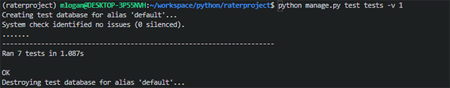
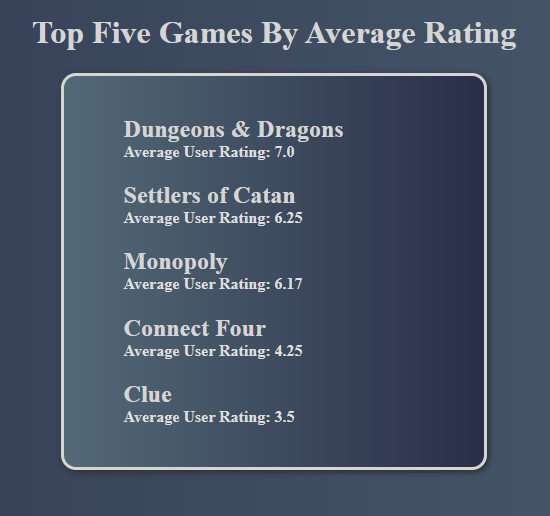

# GamerRater :game_die:

## Full Stack Exercise
### Nashville Software School, Evening Cohort 12

**GamerRater** is a full-stack app, built with React, Python and the Django REST Framework.

## Visit [GamerRater Front-End](https://github.com/MLogan1998/gamerraterclient) for project README.

## Features:
* REST API
* API Integration Tests
* HTML Reports with Django Templates

## Technologies Used:
* Python
* Django REST Framework
* Django Templates
* SQL

### Testing:

### Django Template Report:

## Visit [My portfolio](https://logandevelopment.io)
